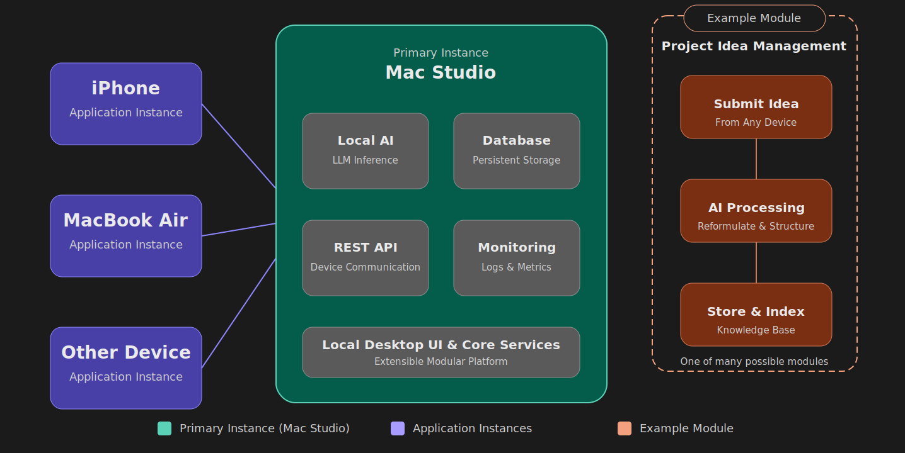

# Nexus

> A self-hosted personal hub combining local AI, knowledge management, system monitoring and multi-device sync — all in
> one cohesive app.

---

## Overview

Nexus is a multiplatform application built for macOS and iOS that centralizes personal tools around a self-hosted
infrastructure.

The application is designed to be simple to deploy: users only need to install the Nexus app on their devices. One
device — typically a personal computer such as a Mac Studio — can be designated as the primary instance. This primary
instance hosts the data, runs local AI models, exposes the API used by other devices, and provides its own user
interface.

Other devices running Nexus (Macs, iPhones, and potentially other platforms in the future) connect to the primary
instance through the built-in communication layer. No manual server setup is required beyond selecting a primary
instance.

## Everything stays local, private, and fully under your control.

## Architecture

  

---

## Features

- 💡 **Idea management** — Submit ideas from any device. A local AI model reformulates, structures and stores them in
  your personal knowledge base.
- 🍎 **Native Apple experience** — Install Nexus on macOS and iOS just like any other application. No dedicated server
  software required.
- 📊 **System monitoring** — Visualize logs, service states, host machine performance and system metrics in real time.
- 📱 **Multi-device sync** — Access all features from any connected device through the main instance API.
- 🧩 **Modular architecture** — New features plug in without touching the core. Extend Nexus as your needs grow.
- 🔒 **Fully local AI** — All AI inference runs on your own hardware. No data leaves your machine.

---

## Tech Stack

- **Rust**
- **Swift**

---

## Getting Started

🚧 Nexus is currently in early development.

Installation packages and setup instructions will be available once the first public version is released.

### Planned Installation

1. Download Nexus on your Mac.
2. Choose a device to become the Primary Instance.
3. Install Nexus on your other devices.
4. Connect them to your Primary Instance.
5. Start using your personal AI-powered ecosystem.

No complex server setup will be required.

## Vision

Nexus aims to become the definitive self-hosted personal hub for individuals who want to centralize their digital life
without relying on third-party cloud services.

Unlike traditional self-hosted solutions that require managing multiple services, dashboards, and deployment tools,
Nexus is designed to feel like a regular application. Simply install the app on your devices, choose a primary instance,
and immediately access your personal ecosystem.

The primary instance hosts your data, runs local AI models, provides monitoring capabilities, and acts as the central
point for synchronization between devices. Every other device runs the same application and connects seamlessly to this
instance through the built-in communication layer.

By combining local AI, persistent knowledge management, system monitoring, and seamless multi-device access, Nexus gives
you full ownership of your data and your tools while remaining simple to deploy and use.

The long-term goal is to provide a modular platform where users can build their own personal ecosystem around a single
application. Idea management is only one example: future modules could include automation, file management, AI
assistants, personal analytics, development tools, and any other functionality that benefits from local AI and
centralized data.

Nexus is built around three core principles:

- 🔒 **Ownership** — Your data stays on your hardware.
- 🧠 **Intelligence** — Local AI enhances and organizes your information.
- 🧩 **Extensibility** — New modules can be added without changing the core platform.

The vision is simple: create a personal operating hub that is as easy to install as a consumer app, while providing the
power, privacy, and flexibility of a fully self-hosted platform.

---

## Status

🚧 **Early development** — core architecture in progress. Contributions and feedback welcome.
